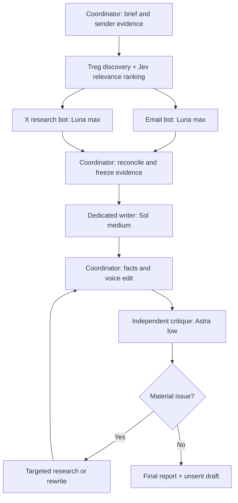

# Standalone Outreach

A Codex skill for finding relevant professional contacts and preparing researched, tailored outreach. It includes work-email verification, LinkedIn/X research, dedicated drafting and independent critique. **It prepares drafts; it does not send them.**

## Flow



Lead with the role or purpose, connect one supported piece of experience, offer one practical contribution, and make one simple ask. Validate the need before proposing automation.

## Install and use

Clone this repository into your Codex skills directory, in a folder named `standalone-outreach`, then start a new session.

```text
Use $standalone-outreach to research two relevant contacts at Example Company
for a partnership introduction. Use my supplied profile, include work email
and X research, and prepare drafts without sending. Provider budget: $1 total,
with $0.50 each for Treg and OpenRouter.
```

The multi-agent flow uses the preferred models above when available and authorized; otherwise it discloses its execution limits. Live research needs Treg access; Jev ranking needs an OpenRouter key. Python 3.10+ on Linux/macOS or WSL runs the bundled CLI with no third-party packages. Model bindings are host preferences, not an OpenRouter routing configuration.

```sh
python3 scripts/outreach.py --help
python3 -m unittest discover -s scripts -p 'test_*.py'
```

See [SKILL.md](SKILL.md) for instructions and [pipeline.md](references/pipeline.md) for configuration and budget controls. Run data and credentials stay private. MIT licensed; adapted-source attribution is in [NOTICE](NOTICE).
